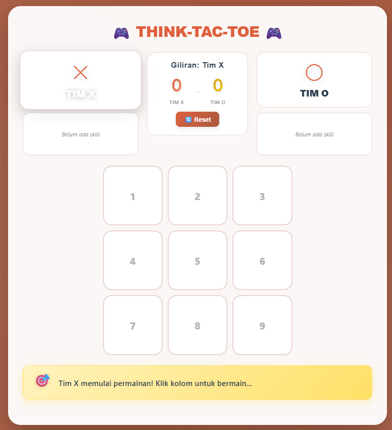
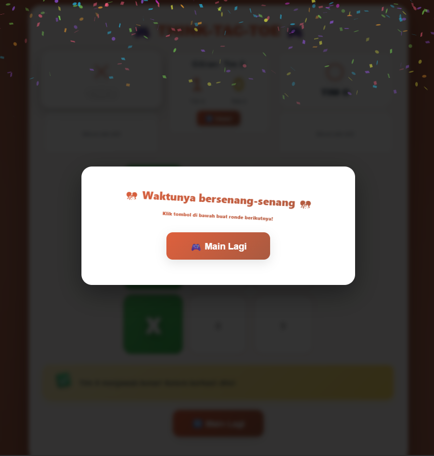

# 🎮 THINK-TAC-TOE

**Tic-Tac-Toe meets Quiz Game!** An interactive educational game that combines classic Tic-Tac-Toe strategy with theme-based question system.


---

## 🌟 Features

### 🎯 Core Gameplay
- **Traditional Tic-Tac-Toe** with an educational twist
- **Theme-Based Questions** - Each cell has a question theme (Definition, Synonym, Antonym, etc.)
- **Turn-Based System** - Team X vs Team O with fair turn rotation
- **Win Detection** - Automatic winner detection with celebration animations

### ⚡ Skill System
- **Mystery Boxes** - Special cells with 2 possible outcomes:
  - 🗑️ **Erase Mark** - Skill to remove 1 opponent's mark
  - 💥 **ZONK** - Get nothing
- **Skill Expiration** - Skills last for 2 turns
- **Strategic Gameplay** - Choose when to use skills wisely
- **Skill Validation** - Newly acquired skills are canceled if the next answer is wrong

### 📊 Scoreboard
- **Real-time Score Tracking** - Live score updates for Team X vs Team O
- **Persistent Scores** - Scores remain across multiple rounds
- **Reset Score** - Button to reset scores anytime

### 🎨 Visual & Audio
- **Modern Glassmorphism Design** - Aesthetic UI with blur effects
- **Smooth Animations** - Fluid transitions for every interaction
- **Confetti Effect** - Victory celebration using canvas-confetti
- **Victory Music** - 3 random victory songs played on win
- **Sound Effects** - SFX for every action (click, skill, zonk, etc.)

### 📱 Responsive Design
- **Mobile Friendly** - Auto-adjusting layout for small screens
- **Cross-browser Compatible** - Runs smoothly on all modern browsers

---

## 🎮 How to Play

1. **Start Game** - Team X always goes first
2. **Select Cell** - Click a cell to answer a question with a specific theme
3. **Answer Question** - Teacher reads the question, answer ✅ Correct or ❌ Wrong
4. **Mystery Box** - Some cells contain mystery boxes:
   - Choose one box
   - Get a skill or zonk
5. **Use Skill** - If you get a skill:
   - ⚡ **Use Skill** - Remove opponent's mark immediately
   - ⏳ **Save for Later** - Save for next turn
6. **Win the Game** - Align 3 marks horizontally, vertically, or diagonally
7. **Score Tracking** - Score automatically increments on win

---

## 🚀 Installation

### Clone Repository
```bash
git clone https://github.com/username/think-tac-toe.git
cd think-tac-toe
```

### Run Locally
Simply open `index.html` in your favorite browser!

```bash
# Or use live server
npx live-server
```

---

## 📁 Project Structure
```
think-tac-toe/
├── assets/                 # Game assets
│   ├── mejikuhibiniu.mp3   # Victory music 1
│   ├── bintanglima.mp3     # Victory music 2
│   ├── kasihababa.mp3      # Victory music 3
│   └── cd.mp3              # Countdown sound
├── img/                    # Image assets
│   ├── mainGame.png        # Main game screenshot
│   ├── mysteryBox.png      # Mystery box screenshot
│   └── victoryScene.png    # Victory screen screenshot
├── index.html              # Main HTML structure
├── style.css               # Styling & animations
├── script.js               # Game logic & interactions
└── README.md               # Documentation
```

---

## 🎨 Customization

### Change Theme Colors
Edit CSS variables in the `:root` section of `style.css`:

```css
:root {
    --gradient-bg: linear-gradient(135deg, #DE603D 0%, #A95A40 100%);
    --gradient-x: linear-gradient(135deg, #DE603D 0%, #FF9966 100%); 
    --gradient-o: linear-gradient(135deg, #DAA520 0%, #FFCC00 100%);
}
```

### Add/Modify Question Themes
Edit the `themes` array in `script.js`:

```javascript
themes: ['Definition', 'Structure', 'Purpose', 'Synonym', 'Antonym', 'General']
```

### Replace Victory Music
Upload your music to GitHub repository and update in `script.js`:

```javascript
const sounds = {
    win: new Audio('your-music-link-1.mp3'),
    win2: new Audio('your-music-link-2.mp3'),
    win3: new Audio('your-music-link-3.mp3')
};
```

---

## 🛠️ Technologies Used

- **HTML5** - Semantic markup structure
- **CSS3** - Modern styling with animations
  - CSS Grid & Flexbox
  - CSS Variables
  - Glassmorphism effects
  - Keyframe animations
- **Vanilla JavaScript** - Game logic & DOM manipulation
- **Canvas Confetti** - Celebration effects
- **Bootstrap Icons** - Icon library

---

## 🎯 Game Rules

### Winning Conditions
- Align 3 marks (X or O) in:
  - **Horizontal** - Row 1, 2, or 3
  - **Vertical** - Column 1, 2, or 3
  - **Diagonal** - Top-left to bottom-right or top-right to bottom-left

### Draw Condition
- All cells are filled without a winner

### Skill Rules
- **Erase Mark** skill lasts for **2 turns**
- If not used within 2 turns, skill expires
- Newly acquired skills are **canceled** if the next question is answered **incorrectly**

---

## 🤝 Contributing

Contributions are welcome! Feel free to fork this repository and create a pull request.

1. Fork the Project
2. Create your Feature Branch (`git checkout -b feature/AmazingFeature`)
3. Commit your Changes (`git commit -m 'Add some AmazingFeature'`)
4. Push to the Branch (`git push origin feature/AmazingFeature`)
5. Open a Pull Request

---

## 📄 License

This project is licensed under the MIT License - see the [LICENSE](LICENSE) file for details.

---

## 👨‍💻 Author

**Your Name**
- GitHub: [@altschmerzsiuu](https://github.com/altschmerzsiuu)
- Email: aditamaarsyi@gmail.com

---

## 🙏 Acknowledgments

- Sound effects from [Mixkit](https://mixkit.co/)
- Confetti library from [canvas-confetti](https://github.com/catdad/canvas-confetti)
- Icons from [Bootstrap Icons](https://icons.getbootstrap.com/)
- - Victory music by Indonesian Hip-Hop Artist
  - [mejikuhibiniu - Tenxi, Jemsii, Suisei](https://open.spotify.com/track/278PwGlIm7MxVTZud18Rx4?si=dbff9a22a51e4ef6)
  - [Bintang 5 - Tenxi, Jemsii](https://open.spotify.com/track/0HoWTALX2BktSIrSmflWSP?si=721b898fd69c4aef)
  - [Kasih Aba-Aba - Naykilla, Tenxi, Jemsii](https://open.spotify.com/track/5rhwXZP0luMucnEPnYJpbI?si=bed5460dc1644ef8)
- Inspired by classic Tic-Tac-Toe game

---

## 📸 Screenshots

### Main Game


### Mystery Box


### Victory Screen


---

<div align="center">

**⭐ Star this repo if you like it! ⭐**

Made with ❤️ and ☕

</div>
